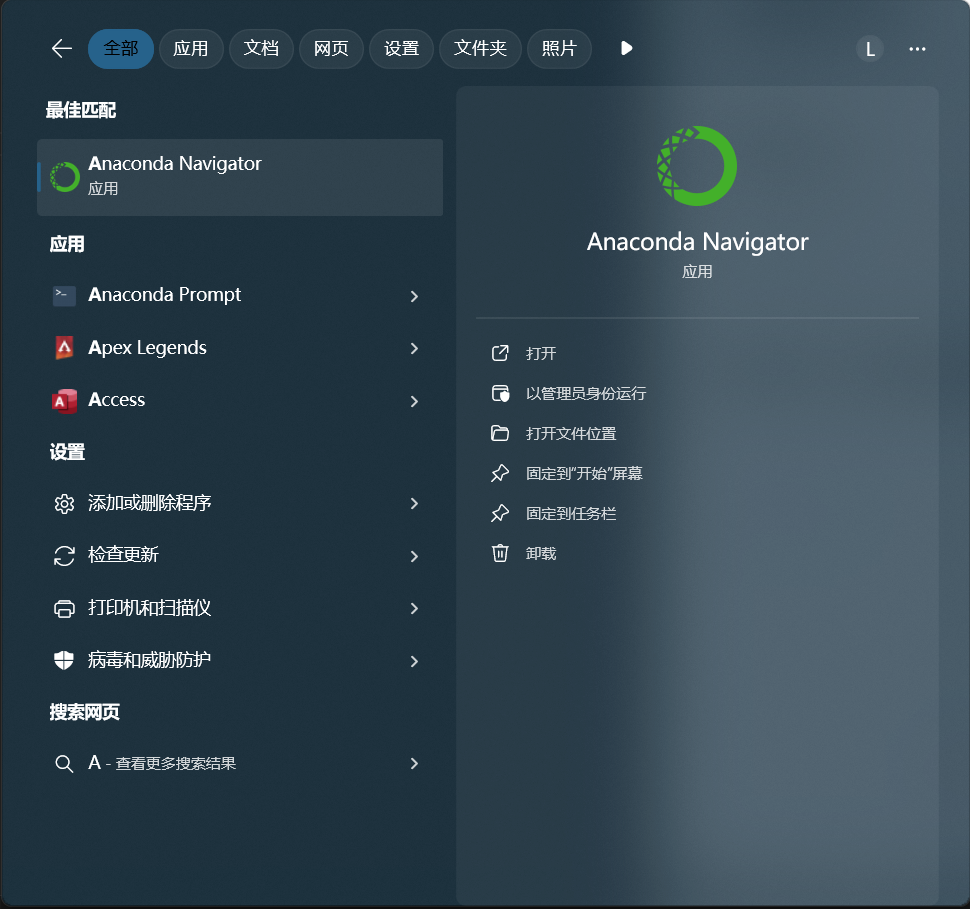
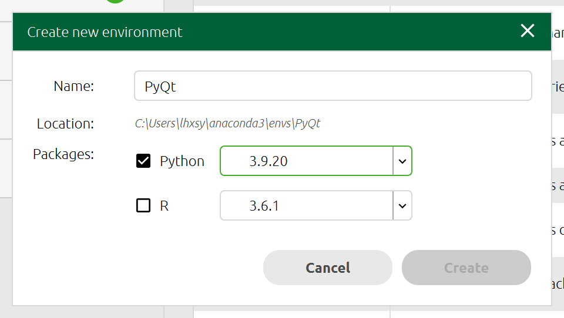
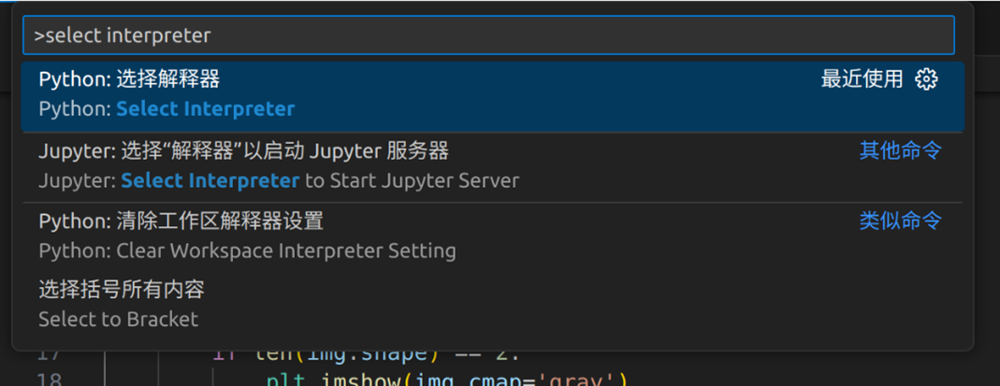
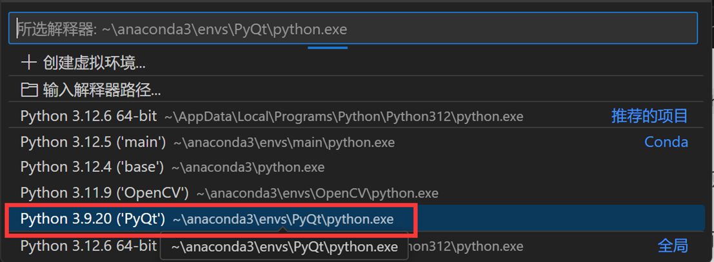
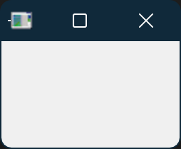

# 如何配置环境

## 0.在VSCode中看Markdown文件

写Markdown文件是一个很重要的技能。
但是这段文字只会教你如何在VSCode中看Markdown文件，如果有兴趣可以进一步学习。

打开“扩展”，快捷键为Ctrl + Shift + X，当然你也可以在程序最左边的功能栏中找到。
搜索“Markdown All in One”，下载安装，随后重启VSCode。

你会发现在右上角有一个图标，允许你打开侧边预览。

如果一切正常，你会在右侧看到Markdown文件展现出来的样子。

## 1.安装Anaconda

访问<https://www.anaconda.com/download/success>，下载Windows版本的Anaconda。

安装完后打开Anaconda Navigator。

## 2.创建新环境

点击这里的"Create"，创建一个Python 3.10.15的环境。
一定要按照我说的选！版本不一致可能会导致很多问题！
名字可以自己选择，本教程中选用*PyQt*。

## 3.安装PyQt

点击这个绿色的按钮，选择"Open Terminal"。

输入以下内容：
`pip config set global.index-url https://pypi.tuna.tsinghua.edu.cn/simple`
`pip install PyQt5 pillow`

解释：第一行是把安装源换成清华源。可以提高下载速度。当然如果已经换过源的可以忽略。
第二行是安装PyQt5和pillow三个模块。

## 4.检测PyQt是否安装正常

打开你的VSCode，在屏幕最上方的搜索框中输入”>Select Interpreter”。

选择你刚刚配置好的环境。

运行Test Codes文件夹中的test.py程序，若出现一个小窗口，则证明环境配置成功

